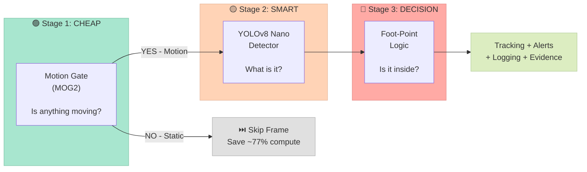
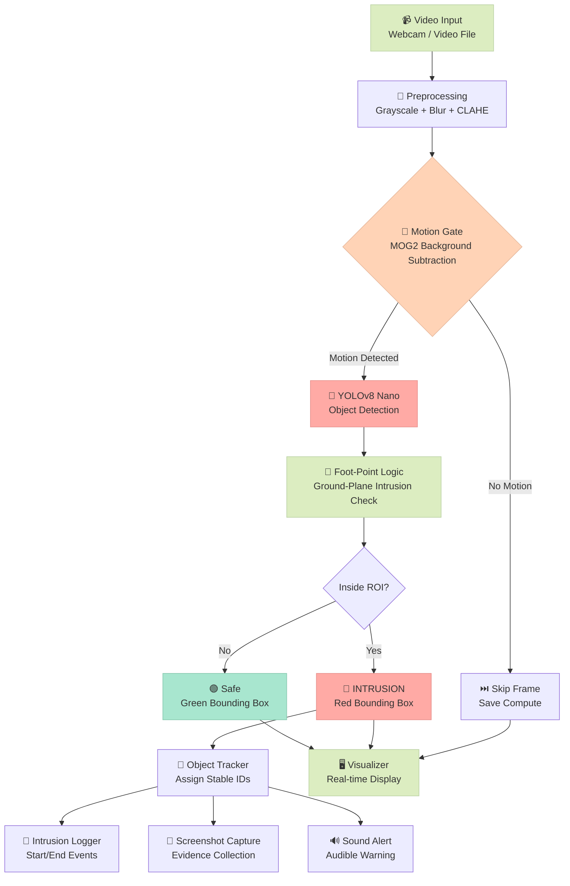
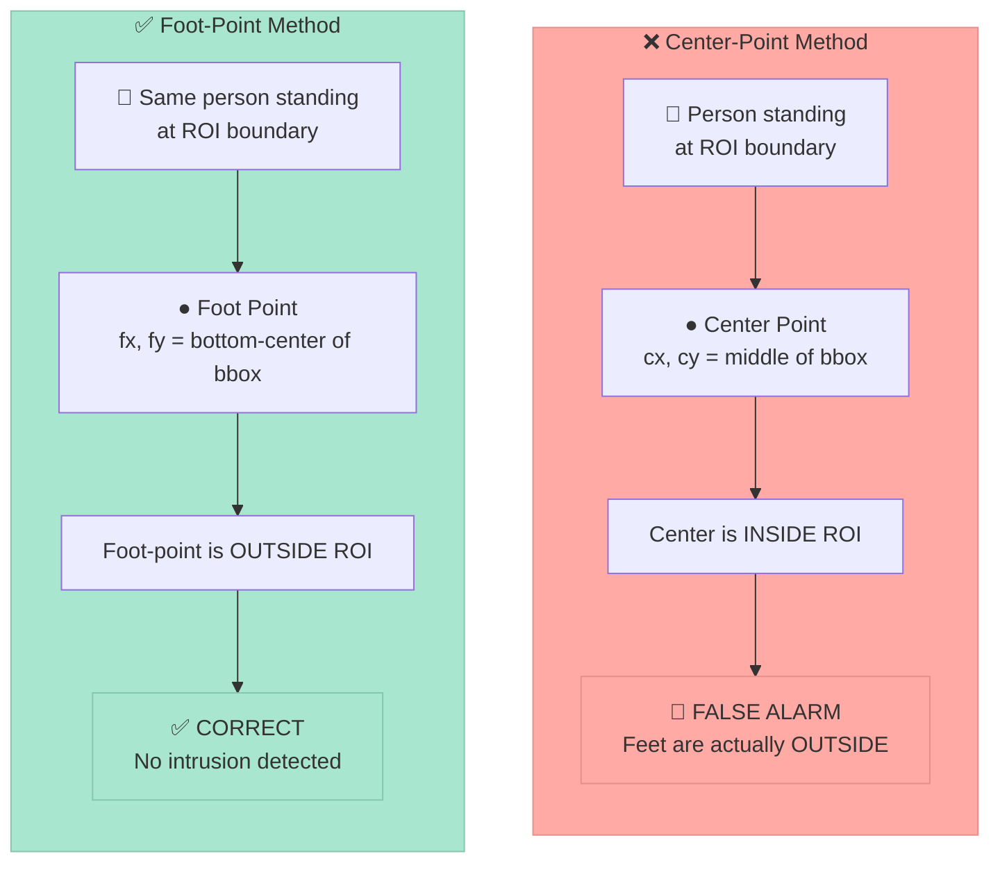
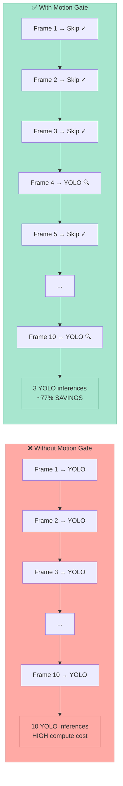
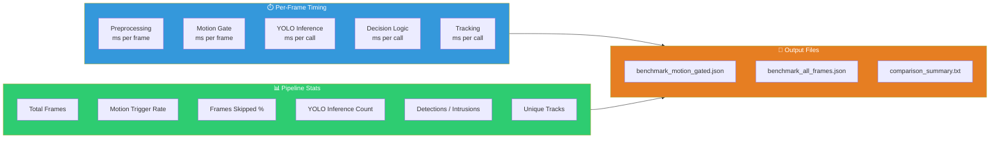

# 🛡️ Intelligent Virtual Fence

> A computer vision-based surveillance system that detects intrusions into user-defined restricted zones using YOLOv8 object detection with an efficiency-optimized, motion-gated architecture.

**Project Type:** UG Final Year Project — Computer Vision Surveillance System

---

## Table of Contents

- [System Architecture](#system-architecture)
- [High-Level Pipeline](#high-level-pipeline)
- [Module Interaction Diagram](#module-interaction-diagram)
- [Processing Pipeline Detail](#processing-pipeline-detail)
- [Foot-Point Detection Logic](#foot-point-detection-logic)
- [Motion Gate Efficiency](#motion-gate-efficiency)
- [Features](#features)
- [Project Structure](#project-structure)
- [Requirements](#requirements)
- [Installation](#installation)
- [Usage](#usage)
- [Configuration](#configuration)
- [Output](#output)
- [Testing](#testing)
- [Benchmarking](#benchmarking)
- [Demo Video Test Set](#demo-video-test-set)
- [Technical Details](#technical-details)
- [Troubleshooting](#troubleshooting)
- [License](#license)

---

## System Architecture

The system follows a **three-stage escalation architecture** — each stage acts as a filter, ensuring expensive AI operations run only when truly needed.



| Stage | Module | Purpose | Cost |
|-------|--------|---------|------|
| 🟢 **Cheap** | Motion Gate (MOG2) | Filter frames with no activity | Very Low |
| 🟡 **Smart** | YOLOv8 Nano Detector | Classify what is moving (person/animal) | High |
| 🔴 **Decision** | Foot-Point Logic | Determine if target is inside restricted zone | Very Low |

> **Key Insight:** By placing a cheap motion filter *before* the expensive YOLO detector, we avoid ~77% of unnecessary AI inferences while maintaining detection accuracy.

---

## High-Level Pipeline




## Foot-Point Detection Logic

### Why Foot-Point Instead of Center-Point?

Traditional intrusion detection checks the **center** of the bounding box. This causes **false positives** when a person's upper body extends over a boundary but their feet remain outside.

Our system uses the **foot-point** (bottom-center of the bounding box), which approximates where the person physically contacts the ground.



> **Result:** Foot-point better approximates the physical contact location of a person with the ground, reducing false intrusion decisions when only the upper body extends over the ROI boundary.

---

## Motion Gate Efficiency

The motion gate is the key to achieving real-time performance. By filtering out static frames *before* running YOLO, the system dramatically reduces computational load.



| Metric | Without Gate | With Gate | Savings |
|--------|-------------|-----------|---------|
| YOLO inferences/sec | ~30 | ~7 | **~77%** |
| CPU utilization | High | Moderate | Significant |
| Real-time capable? | Borderline | ✅ Yes (~28+ FPS) | — |


## Features

- **User-defined ROI**: Draw custom polygon zones interactively
- **Foot-point intrusion detection**: Ground-level spatial reasoning (not bbox center)
- **Motion-gated YOLO**: Efficient - only runs detection when needed
- **Configurable targets**: Switch between humans only, animals only, or humans + animals
- **Object tracking**: Assigns stable IDs so the same person/animal is counted once
- **Start/end intrusion logs**: Logs only when a tracked intruder enters or leaves the ROI
- **Alert priority levels**: Humans are high priority; animals are medium priority
- **Low-light enhancement**: Automatic CLAHE when scene is dark
- **Real-time visualization**: Green (safe) / Red (intrusion) color coding
- **Intrusion logging**: Timestamped audit trail
- **Auto-screenshot**: Captures evidence on intrusion
- **Live controls**: Pause, adjust sensitivity, toggle debug view
- **Real-time FPS display**: Monitor system performance
- **Intrusion duration timer**: Shows how long a target object has been in zone
- **Sound alert**: Beep notification on intrusion (Windows)

---

## Project Structure

```
Intelligent Virtual Fence/
├── README.md                    # This file
├── requirements.txt             # Python dependencies
├── configs/
│   ├── config.json              # Main configuration (video, detector, alerts)
│   └── roi_config.json          # Saved ROI polygon points
├── logs/
│   └── intrusions.log           # Timestamped intrusion event log
├── benchmark_results/           # Generated benchmark data (JSON + text)
├── assets/
│   ├── videos/                  # Input video files
│   └── screenshots/             # Auto-captured intrusion evidence
├── tests/
│   └── test_tracking_and_config.py  # Unit tests
└── src/
    ├── main.py                  # 🎯 Entry point & orchestrator
    ├── benchmark.py             # 📊 Headless performance benchmark
    ├── utils.py                 # Logger, screenshot, config, FPS, sound
    └── core/
        ├── input_manager.py     # Module 1: Video source handling
        ├── roi_manager.py       # Module 2: Interactive ROI polygon drawing
        ├── preprocess.py        # Module 3: Grayscale, blur, CLAHE enhancement
        ├── preprocessor.py      # Module 3b: Extended preprocessing
        ├── motion_gate.py       # Module 4: MOG2 motion detection gate
        ├── detector.py          # Module 5: YOLOv8 Nano object detection
        ├── decision_logic.py    # Module 6: Foot-point intrusion reasoning
        ├── tracker.py           # Object tracker: IoU + distance matching
        └── visualizer.py        # Module 7: Drawing, alerts, color coding
```

### Module Responsibility Summary

| Module | File | Input | Output | Key Algorithm |
|--------|------|-------|--------|---------------|
| 1. Input Manager | `input_manager.py` | Video path / camera index | BGR frames | OpenCV VideoCapture |
| 2. ROI Manager | `roi_manager.py` | User mouse clicks | Polygon points + binary mask | Interactive polygon drawing |
| 3. Preprocessor | `preprocess.py` | BGR frame | Grayscale + enhancement flag | CLAHE (conditional) |
| 4. Motion Gate | `motion_gate.py` | Grayscale frame + ROI mask | Trigger boolean + motion score | MOG2 + morphology |
| 5. Detector | `detector.py` | BGR frame | Bounding boxes + classes | YOLOv8 Nano |
| 6. Decision Logic | `decision_logic.py` | Detections + ROI polygon | Intrusion flags per detection | Foot-point + pointPolygonTest |
| 7. Visualizer | `visualizer.py` | Frame + intrusions | Annotated display frame | OpenCV drawing |
| — Tracker | `tracker.py` | Detections with foot-points | Tracked detections with IDs | Greedy IoU + distance |

---

## Requirements

- Python 3.10+
- Webcam or video file
- Windows/Linux/Mac

## Installation

1. **Clone or download the project**

2. **Create virtual environment** (recommended)
   ```bash
   python -m venv .venv
   
   # Windows
   .venv\Scripts\activate
   
   # Linux/Mac
   source .venv/bin/activate
   ```

3. **Install dependencies**
   ```bash
   pip install -r requirements.txt
   ```

4. **Download YOLOv8 model** (auto-downloads on first run)
   - The system uses `yolov8n.pt` (nano model)
   - It will download automatically when you first run the program

## Usage

### Basic Run
```bash
cd src
python main.py
```

### Select Video Source
```bash
# Use configured source from configs/config.json
python main.py

# Use a different video file
python main.py --source assets/videos/demo.mp4

# Use webcam 0
python main.py --webcam

# Use another camera index
python main.py --webcam --camera-index 1
```

### First Run - ROI Setup
1. When prompted, draw your restricted zone by clicking points
2. Press **ENTER** to finish the polygon
3. Type `y` to save the ROI for future runs

### Keyboard Controls (During Playback)

| Key | Action |
|-----|--------|
| `q` | Quit |
| `SPACE` | Pause / Resume |
| `d` | Toggle debug window (motion mask) |
| `+` or `=` | Increase motion sensitivity |
| `-` | Decrease motion sensitivity |
| `s` | Take manual screenshot |
| `h` | Detect humans only |
| `a` | Detect animals only |
| `m` | Detect humans + animals |

### ROI Drawing Controls

| Key | Action |
|-----|--------|
| Left Click | Add point |
| Right Click | Undo last point |
| `ENTER` | Finish drawing |
| `R` | Reset all points |
| `S` | Save ROI |
| `L` | Load saved ROI |
| `Q` | Quit |

## Configuration

All settings are in `configs/config.json`:

```json
{
    "video": {
        "source": "assets/videos/demo.mp4",
        "width": 640,
        "height": 360
    },
    "motion_gate": {
        "threshold": 500
    },
    "detector": {
        "model": "yolov8n.pt",
        "confidence_threshold": 0.4,
        "active_profile": "humans_only",
        "target_profiles": {
            "humans_only": {
                "label": "Humans only",
                "classes": [0]
            },
            "animals_only": {
                "label": "Animals only",
                "classes": [14, 15, 16, 17, 18, 19, 20, 21, 22, 23]
            },
            "humans_animals": {
                "label": "Humans + animals",
                "classes": [0, 14, 15, 16, 17, 18, 19, 20, 21, 22, 23]
            }
        }
    },
    "tracking": {
        "enabled": true,
        "max_missing_frames": 15,
        "iou_threshold": 0.2,
        "distance_threshold": 80
    },
    "alerts": {
        "sound_enabled": true,
        "sound_frequency": 1000,
        "sound_duration_ms": 150,
        "sound_cooldown_seconds": 2.0
    },
    "logging": {
        "screenshot_on_intrusion": true
    }
}
```

## Output

### Console Output
```
[Main] Processed 376 frames.
[Main] Average FPS: 28.5
[Main] Enhanced frames: 0 (0.0%)
[Main] Motion triggers: 78 (20.7%)
[Main] YOLO inferences: 78, Detections: 143
[Main] Intrusion detections: 58 (target objects inside ROI)
[Main] Unique intruders: 2
[Main] Tracks created: 4
[Main] Max intrusion duration: 4.2s
[Main] Total time in zone: 12.8s
[Main] Screenshots saved: 2
[Main] Sound alerts: 3
```

### Log File Sample (`logs/intrusions.log`)
```
[2026-02-11 10:30:45.123] SESSION STARTED
[2026-02-11 10:30:47.456] INTRUSION START - Frame 85: Track 1 person inside ROI (HIGH)
  -> foot-point (320, 280), confidence: 0.87
[2026-02-11 10:30:51.673] INTRUSION END - Frame 140: Track 1 person left ROI after 4.2s
  -> last foot-point (365, 285)
[2026-02-11 10:31:02.789] SESSION ENDED
```

### Target Class IDs

YOLOv8 uses COCO class IDs. The default profiles use:

| ID | Class |
|----|-------|
| 0 | person |
| 14 | bird |
| 15 | cat |
| 16 | dog |
| 17 | horse |
| 18 | sheep |
| 19 | cow |
| 20 | elephant |
| 21 | bear |
| 22 | zebra |
| 23 | giraffe |

## Testing

Run lightweight validation tests:

```bash
python -m unittest discover -s tests
```

These tests check tracking IDs, config-driven preprocessing, required config sections, and start/end intrusion logging.

## Demo Video Test Set

The repository currently includes `assets/videos/demo.mp4`. For final evaluation, add separate real clips for:

| Case | Suggested filename | Purpose |
|------|--------------------|---------| 
| Day | `assets/videos/day_demo.mp4` | Normal daylight intrusion |
| Night / low light | `assets/videos/night_demo.mp4` | CLAHE and low-light behavior |
| Indoor | `assets/videos/indoor_demo.mp4` | Room/corridor scene |
| Outdoor | `assets/videos/outdoor_demo.mp4` | Background movement and distance |
| False alarm | `assets/videos/false_alarm_demo.mp4` | Motion outside ROI or harmless movement |

## Benchmarking

The project includes a **headless benchmark script** that runs the full pipeline without opening any GUI windows and collects detailed per-frame timing data. This is essential for generating real performance metrics for your presentation.

### Quick Start

```bash
cd src

# Run with motion gate (default mode)
python benchmark.py

# Run WITHOUT motion gate (YOLO on every frame) for comparison
python benchmark.py --all-frames

# Run BOTH modes and generate a side-by-side comparison
python benchmark.py --compare

# Use a specific video file
python benchmark.py --source ../assets/videos/demo.mp4 --compare
```

### What It Measures



### Output Files

Results are saved to `benchmark_results/`:

| File | Contents |
|------|----------|
| `benchmark_motion_gated.json` | Full metrics with motion gate enabled |
| `benchmark_all_frames.json` | Full metrics with YOLO on every frame |
| `comparison_summary.txt` | Side-by-side comparison table |

### Example Comparison Output

```
======================================================================
  PERFORMANCE COMPARISON: Motion-Gated vs All-Frames
======================================================================

Metric                              Motion-Gated      All-Frames
----------------------------------------------------------------------
Total frames                               376             376
Average FPS                               28.5            12.3
YOLO inferences                             78             346
Frames skipped (no YOLO)                   298               0
Skip rate %                              79.3%            0.0%
Total detections                           143             412
Total intrusions                            58              58
Unique tracks                                2               2

Frame time mean (ms)                     35.09           81.30
YOLO mean (ms)                           42.15           41.89
YOLO calls                                 78             346

  >> YOLO Compute Savings: 77.5%
  >> Frame Processing Speedup: 2.32x
  >> FPS Improvement: +16.2 FPS
======================================================================
```

> **Note:** The example above shows approximate expected values. Run `python benchmark.py --compare` to generate your actual numbers on your hardware.

## Technical Details

### Why Foot-Point Detection?

Traditional methods use bounding box center or overlap. We use **foot-point** (bottom-center of bbox):

> "Foot-point better approximates the physical contact location of a person with the ground, reducing false intrusion decisions when only the upper body enters the ROI."

This is how real surveillance systems work - intrusion happens on the **ground plane**.

### Efficiency Metrics

The motion gate typically filters 70-85% of frames:
- Without gate: 30 FPS × YOLO = 30 inferences/second
- With gate: ~7 inferences/second (only when motion)
- **Savings: ~77% compute reduction**

### Key Algorithms Used

| Algorithm | Purpose | Library |
|-----------|---------|---------|
| MOG2 (Mixture of Gaussians v2) | Background subtraction for motion detection | OpenCV |
| YOLOv8 Nano | Single-pass object detection (COCO-pretrained) | Ultralytics |
| CLAHE | Adaptive histogram equalization for low-light | OpenCV |
| Morphological Operations | Noise cleanup on motion masks | OpenCV |
| `pointPolygonTest` | Point-in-polygon check for intrusion decision | OpenCV |
| Greedy IoU + Distance Matching | Simple object tracking across frames | Custom |

### Performance Summary

| Metric | Value |
|--------|-------|
| Average FPS | ~28.5 |
| Motion gate filter rate | ~79% of frames skipped |
| YOLO model | YOLOv8 Nano (6.2 MB) |
| Confidence threshold | 0.4 |
| Tracking persistence | 15 frames |
| Supported targets | 11 COCO classes (person + 10 animals) |

## Troubleshooting

| Issue | Solution |
|-------|----------|
| "Cannot open video source" | Check file path in config.json |
| No display window | Install `opencv-python` (not headless) |
| Video plays too fast | Increase `playback_delay_ms` in config |
| Too many false triggers | Increase motion `threshold` (try 800-1000) |
| Missing detections | Lower `confidence_threshold` (try 0.3) |

## License

Educational project - free to use and modify.

## Author

Computer Vision Surveillance System - UG Final Year Project
